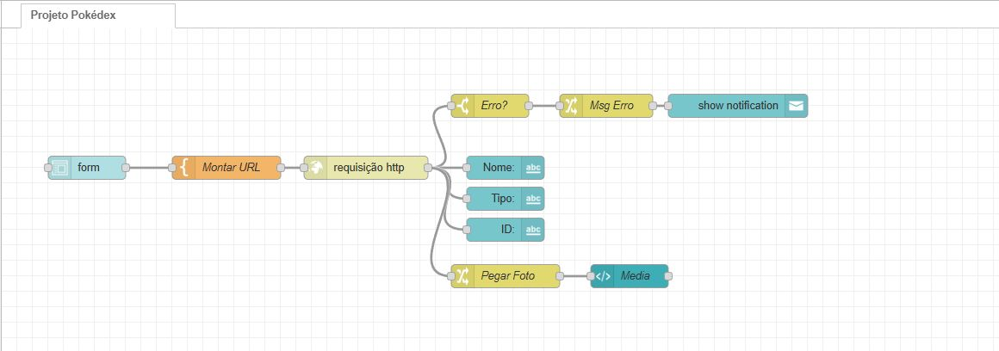
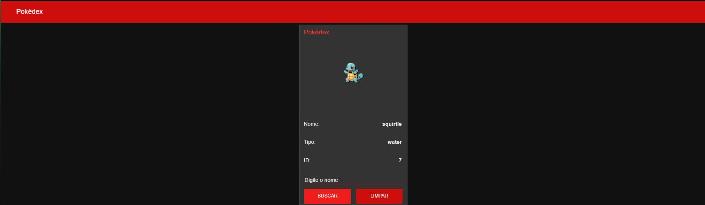

# 📱 Pokédex Interativa - Node-RED

Uma Pokédex interativa desenvolvida com **Node-RED** que consome a API oficial do Pokémon.

## 🚀 Demonstração do Fluxo
Aqui está como a lógica do projeto foi estruturada:

## 🚀 Demonstração do Fluxo

## 🎨 Interface

## 🛠️ Tecnologias
* [Node-RED](https://nodered.org/)
* [PokeAPI](https://pokeapi.co/)

## 📦 Como importar
1. Baixe o arquivo `pokedex-node-red.json.json` deste repositório.
2. No seu Node-RED, vá em **Menu > Import**.
3. Selecione o arquivo e clique em **Import**.
